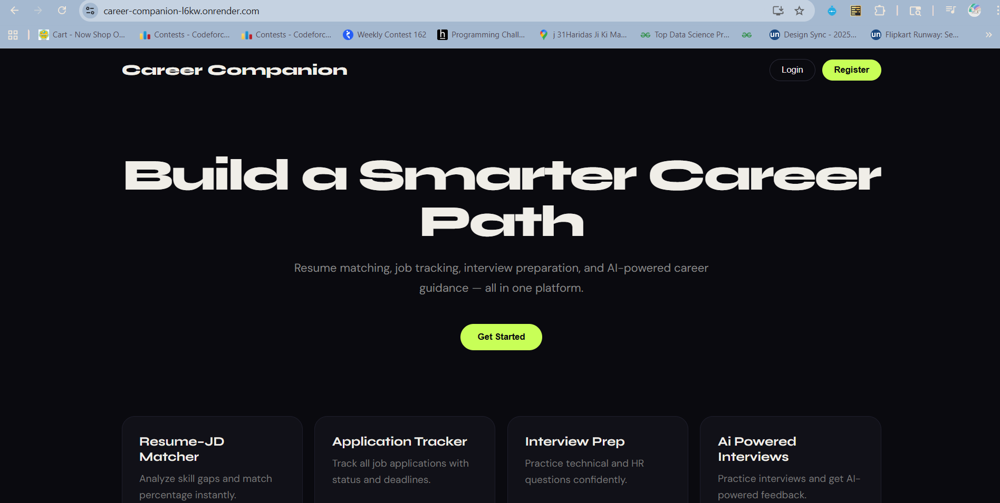

# 🚀 Career Companion

**Career Companion** is an advanced, AI-driven **Career Operating System** designed to bridge the gap between job seekers and their target roles.

By leveraging **Large Language Models (LLMs)**, real-time communication protocols, and automated background processing, the platform provides an end-to-end ecosystem for:

- Resume optimization  
- Technical interview simulation  
- Intelligent job application management  

---

## 🎥 Demo Video

👉 [Watch Demo Video]https://drive.google.com/file/d/1vDtRXO8TIVsqKlnXRmo2a46caBTEeIVa/view?usp=sharing

---

## 🌐 Live Project

👉 [Visit Live Website](https://career-companion-l6kw.onrender.com/)

---

## 🌟 Key Features

---

## 🎙️ Real-time AI Interviewer (WebSockets + Groq)

An immersive **speech-based mock interview platform** that simulates real-world technical interviews.

### Features
- **Low-Latency Interaction**
  - Uses WebSockets for persistent full-duplex communication.
  - Enables seamless voice-to-text conversations.

- **Instant AI Inference**
  - Powered by **Groq API** for near-instant AI responses.

- **Granular Performance Analysis**
  Every response is evaluated across four pillars:
  - ✅ Technical Accuracy  
  - 🗣️ Communication Clarity  
  - 🧠 Depth of Knowledge  
  - 📊 Structured Feedback  

- Generates instant evaluation reports with scores and actionable insights.

---

## 📄 Semantic Resume–JD Matcher

Moves beyond keyword matching by understanding **semantic intent**.

### Capabilities
- Uses Hugging Face SentenceTransformer (all-MiniLM-L6-v2) for semantic matching
- Handles skill normalization (e.g., React.js → react, sklearn → scikit-learn)
- Computes match score between resume and JD
- Generates AI insights using Mistral-7B
- Produces:
  - Match Percentage
  - Skill Alignment Insights
  - Gap Identification
  - AI Insights

---

## 📬 Intelligent Application Tracker (Redis + Celery)

Ensures no job opportunity is missed.

### Features
- 🔔 Automated Reminder System
- Background worker monitors application status.
- Sends reminder emails when status remains **"Not Applied"**.
- Automatic nudges for **3 days before deadline**.

### Infrastructure
- **Celery** → Task Scheduling  
- **Redis** → High-performance Message Broker  

---

## 📅 Adaptive Interview Preparation System

A personalized preparation engine for technical roles:

- Software Engineer (SDE)
- Data Scientist
- Machine Learning Engineer
- Backend / Full Stack Roles

### Functionality
- Dynamic role-based roadmaps
- Topic-wise preparation tasks
- Progress tracking calendar
- Consistency monitoring

---

## 🛠️ Technical Stack

| Layer | Technology |
|------|------------|
| **Frontend** | React.js, JavaScript (ES6+), HTML5, CSS3 |
| **Backend** | Django, Django REST Framework |
| **AI / ML** | SentenceTransformers, Groq API |
| **Real-time** | WebSockets (Django Channels) |
| **Task Queue** | Celery + Redis |
| **Database** | PostgreSQL |
| **Authentication** | JWT via Secure HTTP-Only Cookies |

---

## 🏗️ System Architecture & Security

### 🔐 Secure Authentication
- JWT stored in **HTTP-only cookies**
- Protection against:
  - XSS attacks
  - CSRF vulnerabilities

### ⚡ Asynchronous Processing
- Heavy operations executed via background workers:
  - Email notifications
  - AI evaluation scoring
- Maintains fast, non-blocking UI performance.

### 🗄️ Relational Data Management
- PostgreSQL handles:
  - User progress tracking
  - Application history
  - Career roadmaps

---

---

## 🌱 Vision

Career Companion is built on a simple belief:

> **Career growth should be guided, intelligent, and accessible to everyone.**

This project aims to evolve into a full AI-powered career ecosystem that helps individuals prepare smarter, apply strategically, and grow continuously in their professional journey.

---

## ⚠️ Usage Policy

This repository is shared **strictly for portfolio and demonstration purposes**.

You may **view** the code for learning and evaluation, but:

- ❌ Copying or redistributing the project is not permitted  
- ❌ Using this work as your own submission is prohibited  
- ❌ Commercial usage without permission is not allowed  

All Rights Reserved © 2026 Suhana Kesharwani.

---

## 🤝 Feedback & Collaboration

Ideas, feedback, and discussions are always welcome.

If you’re interested in collaboration, research discussions, or AI innovation — feel free to connect.

---

## 👩‍💻 Author

**Suhana Kesharwani**  
B.Tech Information Technology | AI & Machine Learning Enthusiast  

Building intelligent systems focused on **AI, Healthcare, and Human-Centered Technology**.

---

⭐ *If you found this project interesting, consider giving it a star!*  
